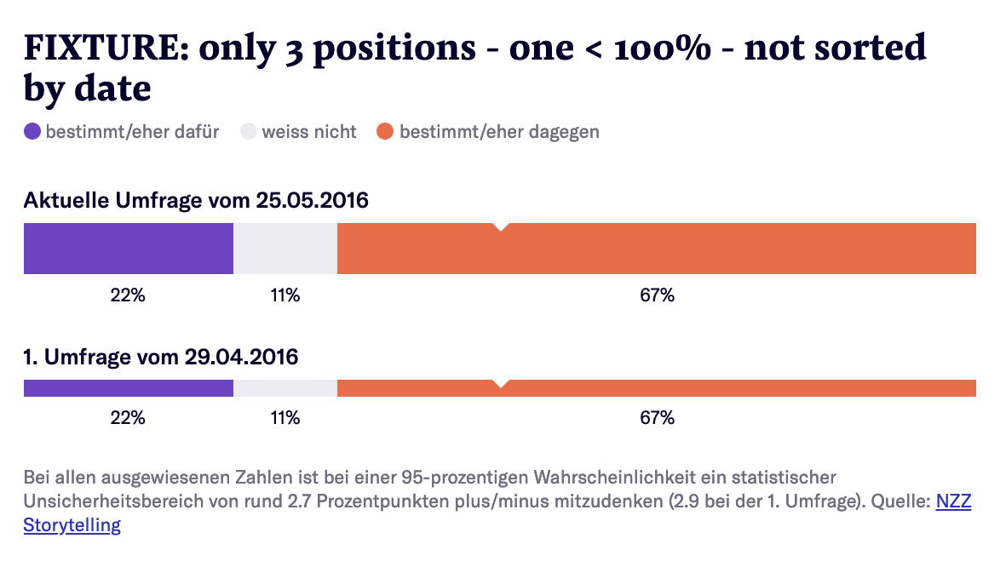

# Q Poll Result [](https://travis-ci.com/nzzdev/Q-poll-result)

**Maintainer**: [manuelroth](https://github.com/manuelroth)

Q Poll Result is one tool of the Q toolbox to render poll results.
Test it in the [demo](https://editor.q.tools).

## Table of contents
 
- [Installation](#installation)
- [Development](#development)
- [Testing](#testing)
- [Tool implementation details ](#tool-implementation-details)
- [Features](#features)
- [License](#license)

## Installation

```bash
$ npm install
$ npm run build
```

[to the top](#table-of-contents)

## Development

Install the [Q cli](https://github.com/nzzdev/Q-cli) and start the Q dev server:

```
$ Q server
```

Run the Q tool:
```
$ node index.js
```

[to the top](#table-of-contents)

## Testing
The testing framework used in this repository is [Code](https://github.com/hapijs/code).

Run the tests:
```
$ npm run test
```

### Implementing a new test

When changing or implementing...
- A `route`, it needs to be tested in the `e2e-tests.js` file
- Something on the frontend, it needs to be tested in the `dom-tests.js` file

[to the top](#table-of-contents)

## Tool implementation details
The tool structure follows the general structure of each Q tool. Further information can be found in [Q server documentation - Developing tools](https://nzzdev.github.io/Q-server/developing-tools.html).

[to the top](#table-of-contents)

## Features

The tool is designed specifically for poll results in Switzerland which are done prior to votings on intiatives and referendums. Hence, we have two pre-defined scales:

* Three answer scale



* Five answer scale


The scales can also be mixed together:


[to the top](#table-of-contents)

### Implementation

The tool uses the [svelte framework](https://svelte.technology/guide) to render the markup on server-side.

## License
Copyright (c) 2019 Neue Zürcher Zeitung. All rights reserved.

This software is published under the MIT license.

[to the top](#table-of-contents)
