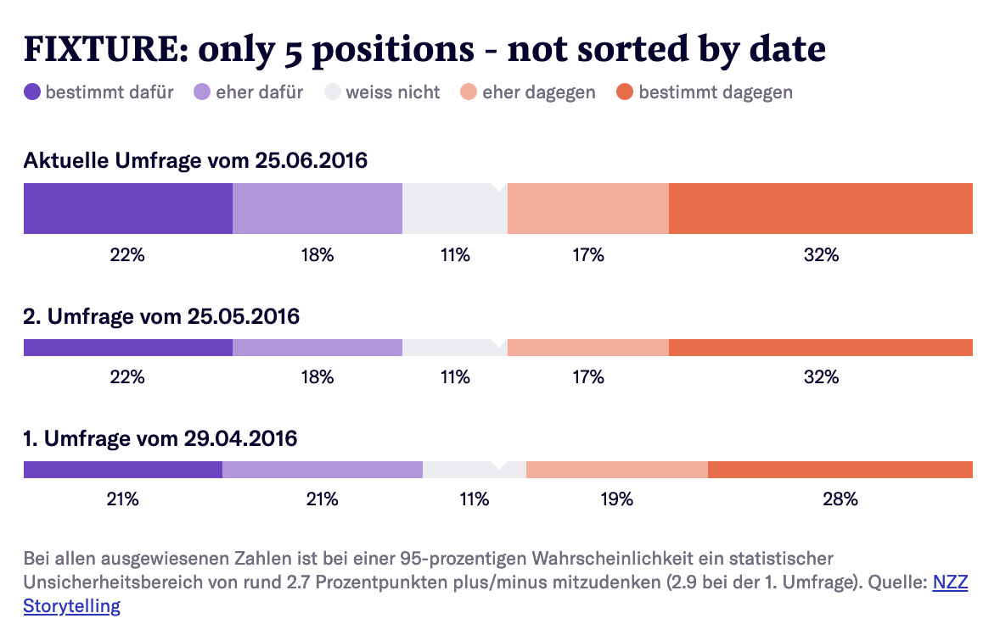
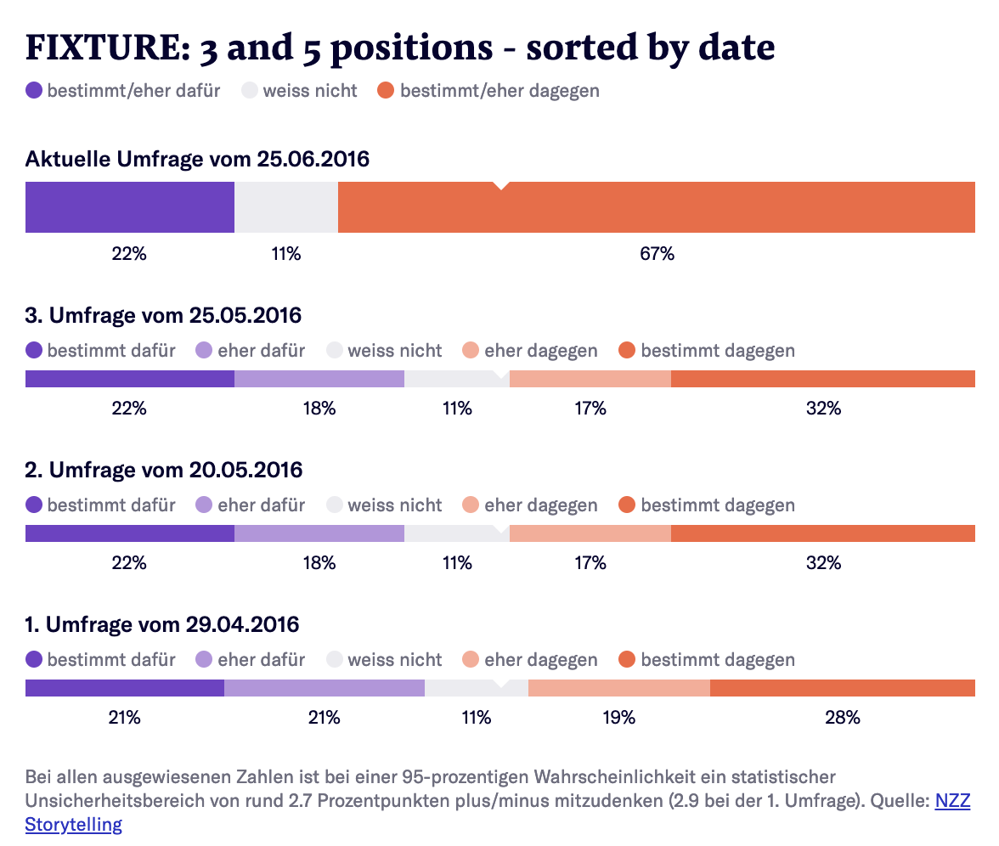

# Q Poll Result [](https://travis-ci.com/nzzdev/Q-poll-result)

**Maintainer**: [manuelroth](https://github.com/manuelroth)

Q Poll Result is one tool of the Q toolbox to render poll results.
Test it in the [demo](https://editor.q.tools).

## Table of contents

- [Installation](#installation)
- [Configuration](#configuration)
- [Development](#development)
- [Testing](#testing)
- [Deployment](#deployment)
- [Functionality](#functionality)
- [License](#license)

## Installation

```bash
git clone git@github.com:nzzdev/Q-poll-result.git
cd ./Q-poll-result
nvm use
npm install
npm run build
```

[to the top](#table-of-contents)

## Configuration

No configuration is needed for this tool.

[to the top](#table-of-contents)

## Development

Start the Q dev server:

```
npx @nzz/q-cli server
```

Run the Q tool:

```
node index.js
```

[to the top](#table-of-contents)

## Testing

The testing framework used in this repository is [Code](https://github.com/hapijs/code).

Run the tests:

```
npm run test
```

### Implementing a new test

When changing or implementing...

- A `route`, it needs to be tested in the `e2e-tests.js` file
- Something on the frontend, it needs to be tested in the `dom-tests.js` file

[to the top](#table-of-contents)

## Deployment

We provide automatically built docker images at https://hub.docker.com/r/nzzonline/q-poll-result/.
There are three options for deployment:

- use the provided images
- build your own docker images
- deploy the service using another technology

### Use the provided docker images

1. Deploy `nzzonline/q-poll-result` to a docker environment
2. Set the ENV variables as described in the [configuration section](#configuration)

[to the top](#table-of-contents)

## Functionality

The tool structure follows the general structure of each Q tool. Further information can be found in [Q server documentation - Developing tools](https://nzzdev.github.io/Q-server/developing-tools.html).

The tool is designed specifically for poll results in Switzerland which are done prior to votings on intiatives and referendums. Hence, we have two pre-defined scales:

- Three answer scale


- Five answer scale



The scales can also be mixed together:



[to the top](#table-of-contents)

### Implementation

The tool uses the [svelte framework](https://svelte.technology/guide) to render the markup on server-side.

### Options

There are no options for this tool.

[to the top](#table-of-contents)

## License

Copyright (c) 2019 Neue Zürcher Zeitung. All rights reserved.

This software is published under the [MIT](LICENSE) license.

[to the top](#table-of-contents)
